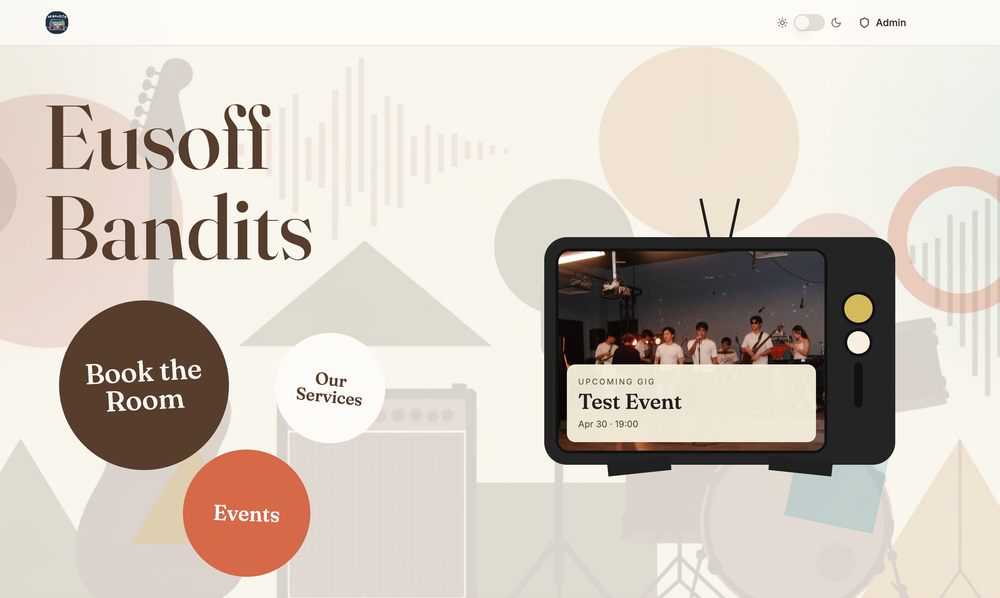
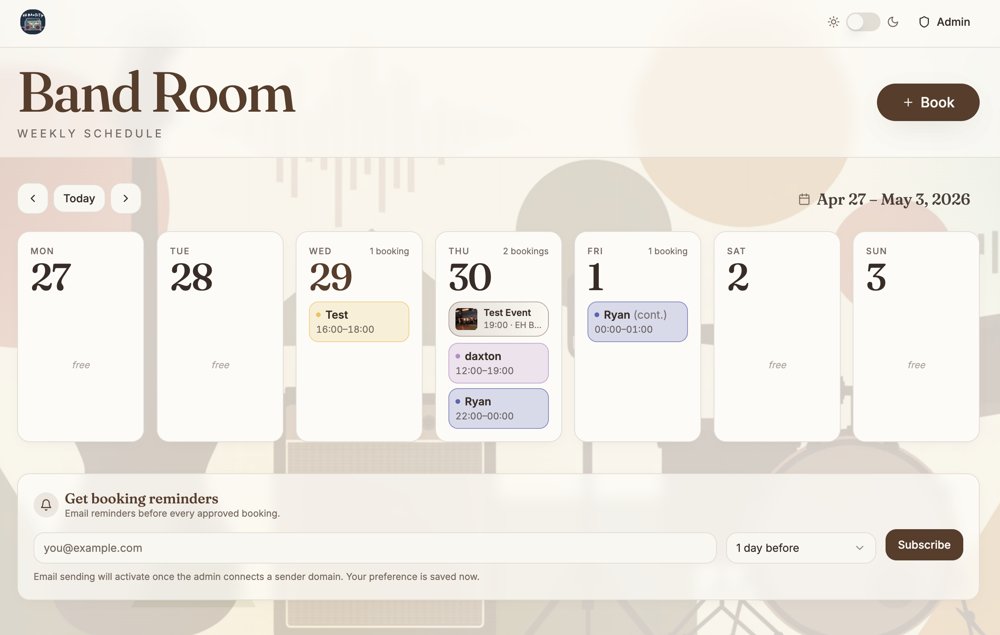
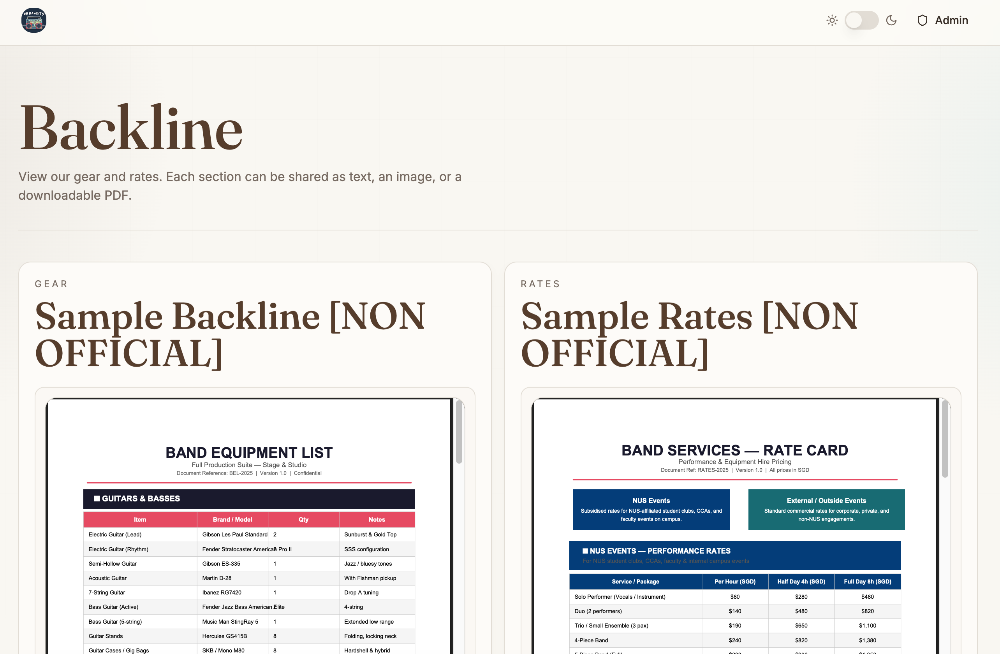
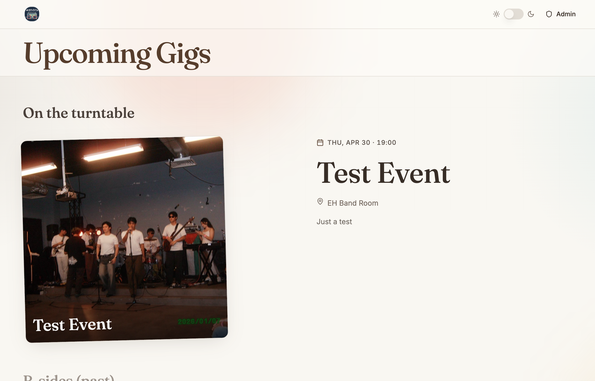

# Eusoff Bandits Website 🎸

> Book and manage your band sessions!

This is a responsive band-room management site for booking practice sessions, sharing upcoming gigs, and viewing backline gear and rates. It is built for quick public access, mobile-friendly browsing, and simple admin workflows for approved band leaders.

---

## Screenshots

| Landing Page | Bookings |
|---|---|
|  |  |

| Backline | Events |
|---|---|
|  |  |

---

## What You Can Do

### Landing Page
- View a Bauhaus-inspired homepage built for desktop and mobile.
- Jump quickly to bookings, events, and services.
- See the next upcoming gig with poster, title, and date.
- Find public contact cards for booking, backline, rates, or gig details.

### Band Room Bookings
- Browse the weekly band room schedule.
- Request a booking with your name and contact.
- Choose a booking color.
- Add one-off or recurring sessions.
- Export bookings and events to a calendar file.
- Submit booking requests with Turnstile protection against spam.

### Events
- View upcoming and past events.
- See event posters, dates, locations, and descriptions.
- Use event listings alongside the booking calendar.

### Backline And Rates
- View Gear and Rates sections.
- Open or download PDFs.
- View image or text-based backline details.
- Use the page comfortably on mobile with horizontal scrolling where needed.

---

## Admin Features

Approved band leaders can:

- Sign in with Supabase Auth.
- Register through invite-protected access.
- Approve, reject, edit, and delete booking requests.
- Resolve booking conflicts.
- Manage recurring booking groups.
- Create and update events with poster uploads.
- Manage Backline Gear and Rates content.
- Add, edit, delete, and reorder public contact cards.

---

## Tech Stack

- Vite
- React
- TypeScript
- Tailwind CSS
- Supabase Auth, Database, Realtime, Storage, and Edge Functions
- Vercel
- Cloudflare Turnstile

---

## Roadmap

- [ ] Email reminders
- [ ] Improved calendar integrations
- [ ] Continued mobile polish

---

## Disclaimer

This is a personal project for managing band-room logistics. It is not an official Eusoff Hall or NUS platform.

`v0.1 release // ryantan 2026`
