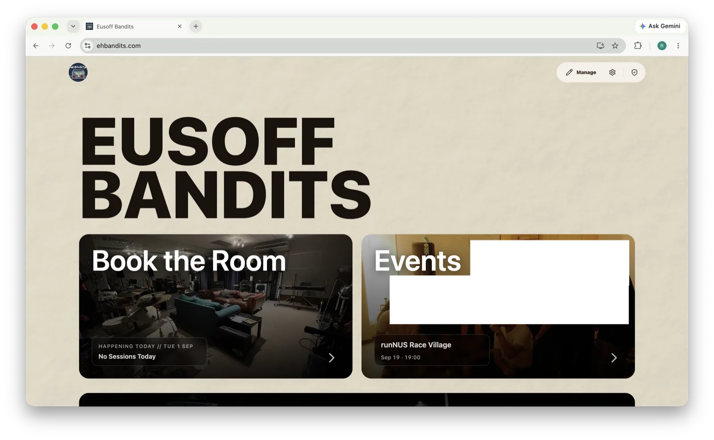
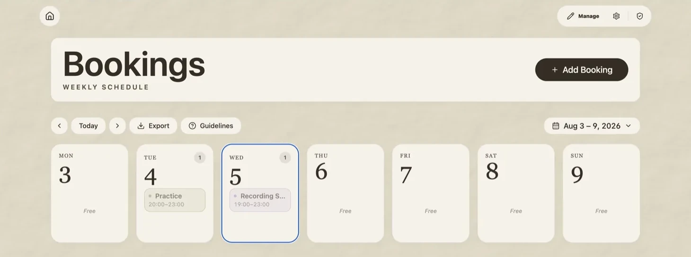
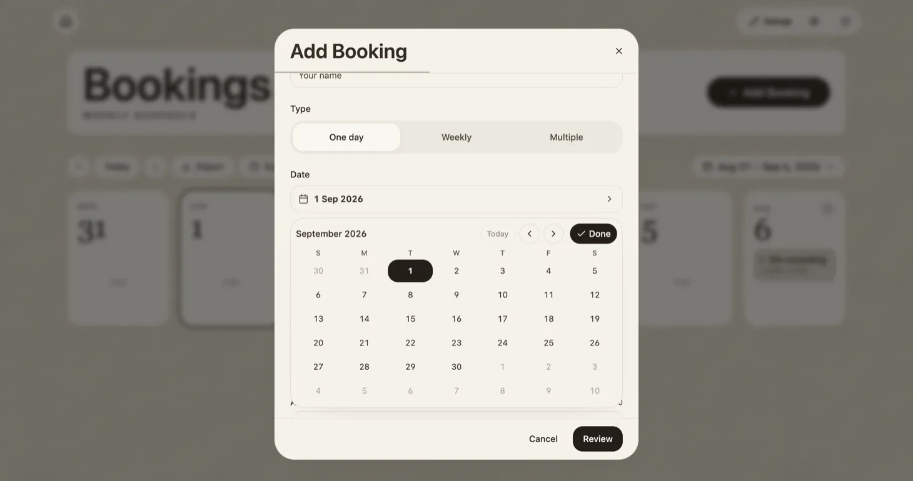
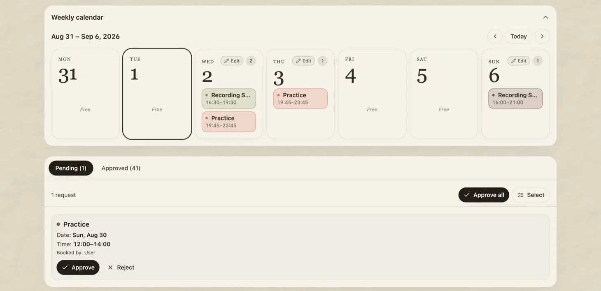
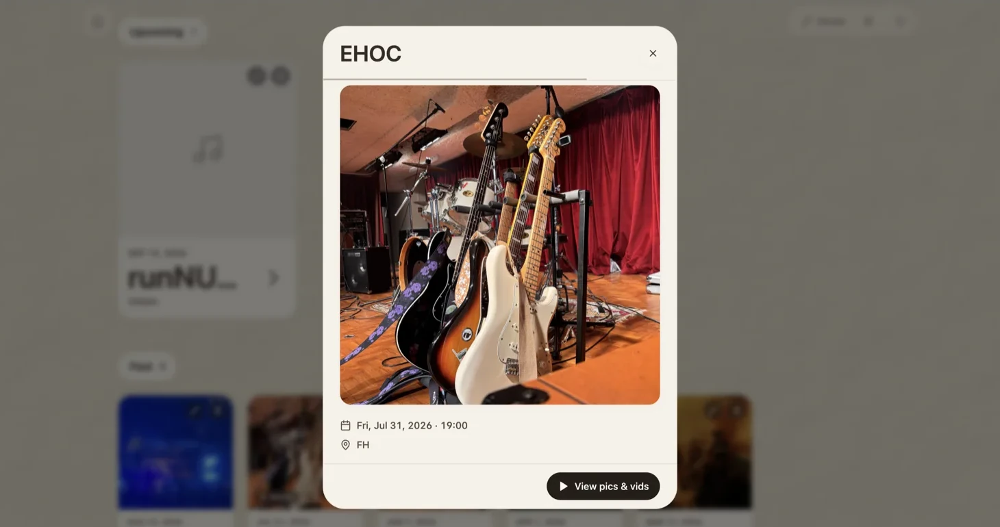
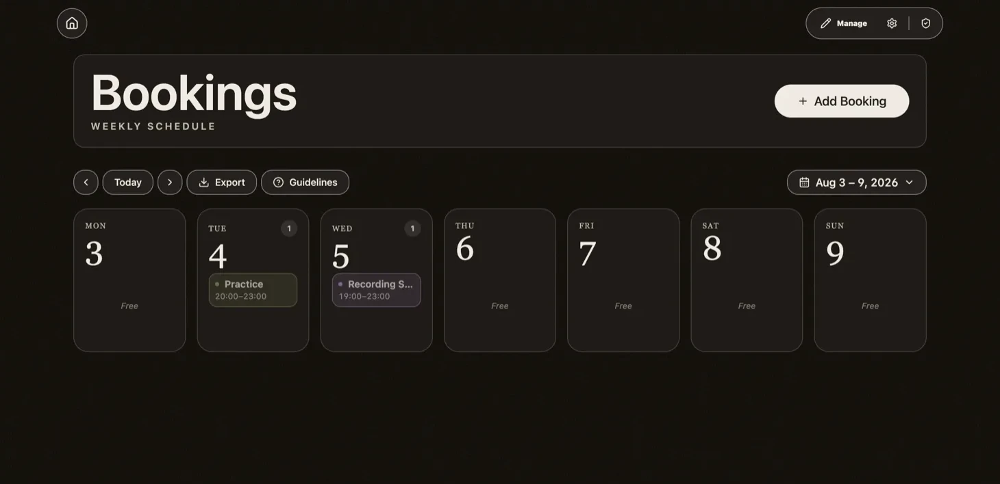

# Eusoff Bandits Band Room

Booking and management for a student band room, built for phones.

[](https://github.com/rtjw42/ehbr-public/actions/workflows/ci.yml)
[](LICENSE)

Members reserve the band room from their phones, browse upcoming events and past media,
and check what backline gear is available. A small group of admins approve requests and
maintain the content from inside the same app, rather than a separate dashboard.

**Live at [ehbandits.com](https://ehbandits.com)**, in daily use by the band.

This is a personal project. It is not an official Eusoff Hall or NUS platform.



| | |
| --- | --- |
|  |  |
| The weekly calendar, updating live as bookings are approved | Requesting a slot: one day, weekly, or a set of picked dates |
|  |  |
| The admin queue, where requests are approved or rejected | An event with its poster, setlist, and media |



<sub>Screenshots are of the live deployment. The repository ships neutral placeholder
images in place of the band's photographs, so a fresh clone looks slightly different.</sub>

## Contents

For anyone: [What it does](#what-it-does) · [Why it works this way](#why-it-works-this-way)

For developers: [Architecture](#architecture) · [Quick start](#quick-start) ·
[Deploy your own](#deploy-your-own) · [Environment variables](#environment-variables) ·
[Scripts](#scripts) · [Security model](#security-model) · [Testing](#testing) ·
[Design](#design) · [License](#license)

## What it does

**Booking.** A weekly calendar backed by Supabase Realtime, so an approval made on one
device appears on every other device without a refresh. A request can be a single slot, a
weekly repeat, or a set of hand-picked dates, and all of it is submitted as one unit that
an admin approves or rejects together. Overlapping approved bookings are rejected by a
database constraint, so first come genuinely wins even under concurrent submissions.

**Events and media.** A public event listing with posters, plus a per-event gallery for
recap videos, photo album links, and typed setlists.

**Backline catalog.** The room's shared gear and rental rates, editable by admins as text,
images, or PDFs.

**Admin overlay.** Approvals and content management live inside the public app behind an
auth gate. Three tiers, all enforced server side:

| Tier | Stored in | Can |
| --- | --- | --- |
| Band Leader | `user_roles.role = 'admin'` | Approve bookings, manage events, backline, and contacts |
| Band Head | `admin_capabilities.is_head` | The above, plus issuing invite codes for new admins |
| Owner | `admin_capabilities.is_owner` | The above, plus promoting and deactivating staff |

New admins register with a single-use invite code that expires after seven days. Only the
SHA-256 hash of a code is stored, never the code itself.

**Consent gate.** First-time visitors see how their booking details are used before the app
loads. Error monitoring and product analytics initialize only after consent is given.

## Why it works this way

Three constraints shaped it more than any preference did.

**It is used on phones, almost entirely.** Layout stability is treated as a feature rather
than a polish item: pinch-zoom is never disabled, safe-area insets are respected, the form
shell keeps one height and slides instead of resizing when the keyboard appears, and
pickers open as overlays so no field jumps under a thumb mid-tap.

**It has to survive a handover.** The band's committee turns over every year, so the app
avoids anything that only its author can operate. Roles, invite codes, and recovery are all
in the app or in documented SQL, and the operational runbook is part of the repository.

**It has to run on free tiers indefinitely.** Reads are bounded, a scheduled ping keeps the
Edge Functions warm, realtime is used only where it earns its cost, and resource use is
tracked against real headroom rather than assumed to be fine.

---

# For developers

Everything below assumes a terminal.

## Architecture

```
React + Vite SPA (TypeScript)
  |
  |-- Supabase Auth         admin sessions, invite-code registration
  |-- Supabase Postgres     all data, row-level security on every table
  |-- Supabase Realtime     live booking calendar
  |-- Supabase Storage      event posters, backline files
  |-- Supabase Edge Funcs   public form validation, privileged writes
  |
Vercel                      static hosting
Cloudflare Turnstile        bot protection on every public form
```

Two boundaries hold the codebase together:

1. **Persistence lives in `src/services/`.** Components and pages never call Supabase
   directly. Query rules, validation, and the row-level-security contract sit in five
   service modules (`auth`, `bookings`, `events`, `backline`, `contacts`), each with
   colocated tests. This is also what makes the data layer testable without rendering
   anything.
2. **Realtime subscriptions stay in components.** They live in the component that renders
   the data rather than inside a service, so the data flow of a live screen can be read
   top to bottom.

Public writes never touch the database directly. Booking submission, admin registration,
and password reset all route through Edge Functions that verify a Turnstile token, check
the request origin, apply a per-IP rate limit, and validate the payload before anything is
written.

## Quick start

Gets the app running against your own Supabase project. You do not need a Cloudflare
account for this: Turnstile publishes test keys that always pass.

Requires Node 20 or newer (there is an `.nvmrc`), npm, the
[Supabase CLI](https://supabase.com/docs/guides/cli), and a free
[Supabase](https://supabase.com) project.

```bash
git clone https://github.com/<your-username>/<your-repo>.git
cd <your-repo>
npm install
cp .env.example .env.local
```

Fill in three values in `.env.local`. The first two are in your Supabase dashboard under
Project Settings, API. The third is Cloudflare's public test key.

```
VITE_SUPABASE_URL=https://<your-project-ref>.supabase.co
VITE_SUPABASE_PUBLISHABLE_KEY=<your-anon-key>
VITE_TURNSTILE_SITE_KEY=1x00000000000000000000AA
```

Apply the schema and start the dev server:

```bash
supabase login
supabase link --project-ref <your-project-ref>
supabase db push
npm run dev
```

The app is on <http://localhost:8080>. Browsing, events, and the backline catalog work
immediately. **Submitting a booking will not**, because public writes go through Edge
Functions that are not deployed yet: continue below for that.

If you see a "Configuration needed" page, one of the three values above is missing.

## Deploy your own

Picks up where Quick start left off, and covers the parts that need real infrastructure.

### 1. Set the Edge Function secrets

```bash
supabase secrets set TURNSTILE_SECRET_KEY=1x0000000000000000000000000000000AA
supabase secrets set RATE_LIMIT_SALT=<random-32-char-string>
supabase secrets set SITE_URL=https://your-domain.example
supabase secrets set ALLOWED_ORIGINS=https://your-domain.example,https://www.your-domain.example
```

The Turnstile value above is the test secret that pairs with the test site key. Swap both
for real ones from your own Turnstile widget before going live.

`ALLOWED_ORIGINS` is the CORS allow-list for the public functions. If it is unset they fall
back to `SITE_URL`, and if both are unset every request is rejected.

### 2. Deploy the Edge Functions

```bash
supabase functions deploy submit-booking register-admin request-password-reset \
  upload-admin-file set-staff-ban telegram-weekly
```

Deploy all of them together. Shared helpers in `supabase/functions/_shared/` are bundled
into each function at deploy time, so every function carries its own copy and redeploying a
subset leaves the rest running the old one.

Bookings submit correctly once this succeeds.

### 3. Create the first owner

There is deliberately no in-app way to grant ownership. Register an account through the app
first, then run this in the Supabase SQL editor, substituting your email:

```sql
insert into public.user_roles (user_id, role)
select id, 'admin' from auth.users where lower(email) = 'you@example.com'
on conflict do nothing;

update public.admin_capabilities set is_owner = true, is_head = true
where user_id = (select id from auth.users where lower(email) = 'you@example.com');
```

The first statement grants the admin role, which triggers creation of the profile and
capability rows. The second promotes that account to owner. Everyone else then joins
through invite codes issued from the Manage screen.

### 4. Make it yours

The copy and branding are written for one specific band. Before putting it in front of
anyone else:

- Replace the legal copy in `src/lib/legal.en.ts` and `src/lib/legal.zh.ts`
- Set `VITE_CONTACT_EMAIL` to a real address, since the privacy policy points at it
- Swap the icons in `public/` and the images in `src/assets/`
- Update the name and description in `index.html` and `public/manifest.webmanifest`

### 5. Host it

Any static host works. On Vercel, point it at the repo, set the `VITE_*` variables in
Project Settings, and deploy. Remember that `VITE_*` values are baked in at build time, so
changing one requires a redeploy.

## Environment variables

**Client, set in `.env.local` and in your host's environment**

| Variable | Required | Purpose |
| --- | --- | --- |
| `VITE_SUPABASE_URL` | Yes | Supabase project URL |
| `VITE_SUPABASE_PUBLISHABLE_KEY` | Yes | Supabase anon key |
| `VITE_TURNSTILE_SITE_KEY` | Yes | Turnstile site key (public) |
| `VITE_CONTACT_EMAIL` | Recommended | Address shown in the privacy policy for data requests |
| `VITE_SENTRY_DSN` | No | Client error monitoring, production only |

**Edge Functions, set with `supabase secrets set`**

| Variable | Required | Purpose |
| --- | --- | --- |
| `TURNSTILE_SECRET_KEY` | Yes | Server-side Turnstile verification |
| `RATE_LIMIT_SALT` | Yes | Salts hashed IPs in the rate-limit ledger |
| `SITE_URL` | Yes | Public origin for absolute links, and the CORS fallback |
| `ALLOWED_ORIGINS` | Recommended | Comma-separated CORS allow-list |
| `TELEGRAM_BOT_TOKEN` | No | Enables outbound Telegram notifications |
| `TELEGRAM_ADMIN_CHAT_ID` | No | Destination for new-booking pings |
| `TELEGRAM_BOARD_CHAT_ID` | No | Destination for the weekly schedule board |

`SUPABASE_URL`, `SUPABASE_ANON_KEY`, and `SUPABASE_SERVICE_ROLE_KEY` are injected by the
platform. Do not set them yourself.

Telegram is optional. Without a bot token the app works normally and simply sends nothing.

## Scripts

| Command | Does |
| --- | --- |
| `npm run dev` | Dev server on port 8080 |
| `npm run build` | Production build |
| `npm run preview` | Serve the production build locally |
| `npm run lint` | ESLint |
| `npm run typecheck` | TypeScript, strict, no unused locals or parameters |
| `npm test` | Vitest |
| `npm run test:coverage` | Tests with a coverage report |

## Security model

The app puts public forms on the internet while keeping write access narrow.

- **Row-level security on every table.** Anonymous reads are bounded and column safe. Every
  select carries an explicit limit, so no query can be made to return an unbounded set.
- **No direct public writes.** Every public submission goes through an Edge Function that
  checks the origin, verifies a Turnstile token, applies a per-IP rate limit, and validates
  the payload. Writes are precisely filtered, RPC backed, or Edge mediated.
- **Server-side authorization.** Admin actions re-verify the live session and role against
  the database on every call. Frontend state is never trusted on its own, and privileged
  RPCs are `SECURITY DEFINER` with execute revoked from anonymous and authenticated roles.
- **Minimal data collection.** A public booking captures a session title and a display name.
  No contact details, no personal identifiers.
- **Content Security Policy** with no inline scripts, and no `innerHTML` or `eval` anywhere
  in the source. Admin tokens use a storage adapter with a 14-day idle timeout.

## Testing

Vitest covers the service layer and the pure Edge Function helpers: booking rules,
recurrence expansion, auth and role checks, text sanitization, and message formatting. That
is where the logic worth protecting sits, so coverage is aimed there rather than at the UI.

CI runs on every push and pull request: typecheck, lint, tests with coverage, production
build, and `npm audit` gated at high severity. Dependabot batches minor and patch updates
weekly.

## Design

A warm, textured palette in both light and dark mode, with color, spacing, motion, and
typography defined as semantic tokens rather than ad-hoc values. The backdrop is a tiling
paper texture painted on the root canvas as one continuous surface, which avoids the seams
and re-fit glitches a fixed background layer causes on iOS Safari.

Motion is compositor-only, transforms and opacity rather than layout properties, because
iOS Low Power Mode caps main-thread work to roughly 30fps and anything animating height
visibly stutters under it.

## License

MIT. See [LICENSE](LICENSE).

The code is MIT licensed. The band's name, logo, icons, and photography are not:
replace the assets in `public/` and `src/assets/` if you deploy your own copy.
